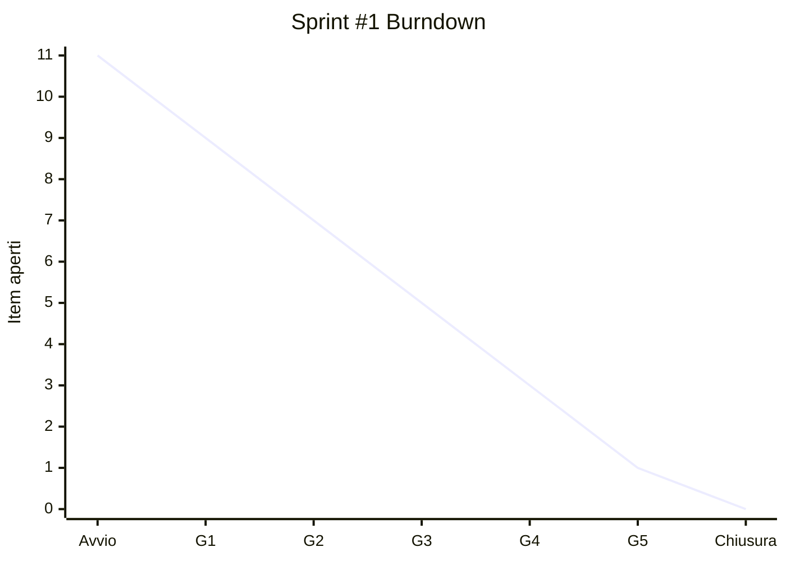

# Report Milestone #3 - RE-VALUE

Deadline: 17/05/2026

Progetto di Ingegneria del Software, Universita di Trento A.A. 2025/2026 - Gruppo 21.

## 1. Sezione introduttiva

### 1.1 Team members

| Nome | Cognome | Matricola | Account GitHub / identita commit | Responsabilita principali |
| --- | --- | --- | --- | --- |
| Alessandro | Gremes | 242330 | `alegrem123` | Backend, autenticazione, annunci, documentazione |
| Paolo | Sarcletti | 246846 | `Paolo Sarcletti` | Prenotazioni, QR/scambio, test di integrazione |
| Alessandro | Turri | 244927 | `Alessandro` | Frontend web/mobile, catalogo, profili |

### 1.2 Project idea

RE-VALUE e una piattaforma per favorire il riuso locale di oggetti ancora utilizzabili. Un utente pubblica un annuncio come donatore, un altro utente prenota l'oggetto e lo ritira tramite validazione QR. Il sistema gestisce catalogo, prenotazioni, chat, wallet crediti, segnalazioni e funzioni amministrative. L'obiettivo e supportare scambi tracciabili e ridurre sprechi, mantenendo un modello semplice e verificabile.

### 1.3 Links

| Risorsa | Link / stato |
| --- | --- |
| Repository GitHub | `https://github.com/alegrem123/ReValue.git` |
| Branch principale di lavoro | `preRelease` |
| Branch stabile | `main` |
| Apiary | Non pubblicato nello Sprint 1; le API sono documentate nel presente report e restano da trasferire su Apiary/OpenAPI |

## 2. Sezione generale

### 2.1 Strategia di branching

La strategia adottata non e stata una "master only strategy". Il repository contiene almeno due branch principali:

- `main`: branch stabile, usato come riferimento principale del repository remoto;
- `preRelease`: branch di integrazione e preparazione della milestone, usato per consolidare funzionalita, bug fix, test e documentazione prima della consegna.

Il flusso di lavoro seguito nello Sprint 1 e stato:

1. implementazione incrementale delle funzionalita per area;
2. commit con messaggi descrittivi, spesso organizzati per modulo (`feat`, `fix`, `test`, `docs`, `style`);
3. integrazione sul branch `preRelease`;
4. verifica tramite test backend;
5. consolidamento della documentazione D3.

I branch `main` e `preRelease` sono mantenuti nel repository remoto per consentire il controllo della cronologia e del lavoro svolto.

Esempi di aree presenti nella cronologia dei commit:

- `feat(auth)`, `feat(wallet)`, `feat(prenotazioni)`, `feat(qr)`;
- `feat(frontend)`, `feat(mobile)`, `feat(chat)`;
- `test(integration)`, `test(qr)`, `docs`.

### 2.2 Product backlog

| ID | Product backlog item | Priorita | Stato Sprint 1 | Evidenza |
| --- | --- | --- | --- | --- |
| PB01 | Registrazione, login e JWT | Alta | Completato | `authController.js`, `authService.js`, `auth.test.js` |
| PB02 | Catalogo pubblico annunci | Alta | Completato | `annunciController.js`, `catalog.js`, `CatalogScreen.js` |
| PB03 | Creazione, modifica e cancellazione annunci | Alta | Completato | `annunciController.js`, `annuncioModel.js` |
| PB04 | Filtri catalogo e privacy posizione | Alta | Completato | `getCatalogo`, `catalog_flow.test.js` |
| PB05 | Prenotazione oggetto | Alta | Completato | `prenotazioniController.js`, `swap.test.js` |
| PB06 | Prevenzione doppia prenotazione concorrente | Alta | Completato | `Annuncio.versione`, `concurrent.test.js` |
| PB07 | Annullamento prenotazione e casi limite | Alta | Completato | `annullaPrenotazione`, `qr_edge_cases.test.js` |
| PB08 | Generazione e validazione QR | Alta | Completato | `qrController.js`, `scambioQrService.js` |
| PB09 | Wallet con saldo e storico | Alta | Completato | `walletService.js`, `wallet.test.js` |
| PB10 | Chat tra partecipanti allo scambio | Media | Completato | `chatController.js`, `messaggiController.js` |
| PB11 | Frontend web per flussi principali | Media | Completato | `frontend/views`, `frontend/js` |
| PB12 | App mobile Expo per flussi principali | Media | Completato | `mobile/App.js`, `mobile/src/screens` |
| PB13 | Dashboard e funzioni admin | Media | Completato | `adminController.js`, `adminRoutes.js` |
| PB14 | Segnalazioni | Media | Parziale | modello e route admin presenti, flusso non centrale |
| PB15 | Recensioni | Bassa | Parziale | modello presente, flusso applicativo da completare |
| PB16 | SPID/SSO | Bassa | Solo progettato | non implementato nello Sprint 1 |
| PB17 | Servizio email | Bassa | Solo progettato | non implementato nello Sprint 1 |
| PB18 | OpenStreetMap backend | Bassa | Solo progettato/parziale | coordinate e geolocalizzazione lato client presenti |
| PB19 | Specifica Apiary/OpenAPI | Media | Da completare | API documentate manualmente in questo report |

### 2.3 Definition of Done

Per considerare completato un item nello Sprint 1 il team ha adottato questa definizione di "Done":

- il comportamento e implementato nel backend o nel client previsto;
- le route principali sono raggiungibili tramite API REST;
- i dati sono persistiti tramite MongoDB/Mongoose quando necessario;
- gli accessi protetti richiedono JWT e rispettano i ruoli previsti;
- i vincoli di dominio principali sono applicati nel controller, service o model;
- il flusso e documentato nel report o nella matrice di tracciabilita;
- quando possibile, il comportamento e coperto da test automatici backend o da test case formale;
- eventuali limiti o funzionalita parziali sono dichiarati esplicitamente.

### 2.4 Organizzazione Scrum/Kanban

Il team ha adottato Scrum come riferimento principale per la pianificazione dello sprint, integrando alcune pratiche Kanban per rendere visibile l'avanzamento del lavoro. In particolare, il workflow e stato gestito con stati semplici:

- `To do`: task pianificati ma non ancora iniziati;
- `Ongoing`: task in lavorazione;
- `Done`: task completati secondo la Definition of Done.

Seguendo l'indicazione delle lezioni su Scrum/Kanban, il team ha cercato di mantenere basso il Work In Progress: ogni componente ha lavorato su un numero limitato di task aperti, evitando di accumulare troppe attivita parallele. Questo ha aiutato a ridurre attese, duplicazioni e conflitti tra modifiche.

La scelta e quindi assimilabile a un approccio Scrumban leggero:

- Scrum per sprint goal, sprint backlog, review e retrospective;
- Kanban per visualizzare il workflow, limitare il WIP e facilitare l'ispezione continua.

### 2.5 Sustainable computing

La prospettiva di Sustainable Computing e GreenOps e stata considerata come criterio progettuale per gli sprint successivi. Nello Sprint 1 il progetto e rimasto principalmente locale/prototipale, quindi non sono state effettuate misure di carbon footprint. Tuttavia sono state adottate e documentate alcune scelte coerenti con la riduzione degli sprechi:

- uso di API REST e frontend statico, evitando componenti infrastrutturali non necessari;
- fallback di sviluppo con MongoDB in memoria solo per ambienti locali e test;
- assenza di job pesanti continui, escluso lo scheduler orario per marcare annunci scaduti;
- riuso dello stesso backend per web e mobile, evitando duplicazione di servizi;
- attenzione a mantenere il sistema modulare, cosi da poter dimensionare separatamente le parti in caso di deployment cloud.

Per gli sprint futuri, se il sistema venisse portato su cloud, il backlog tecnico dovra considerare:

- scelta della regione cloud anche in base a latenza, compliance, costo e impatto ambientale;
- right-sizing delle risorse;
- autoscaling con possibilita di scale-in;
- spegnimento delle risorse inattive in ambienti di test/demo;
- valutazione di architetture serverless o managed per ridurre risorse idle;
- monitoraggio esplicito dei consumi per evitare greenwashing.

## 3. Sezione Sprint #1

### 3.1 Goal dello Sprint

L'obiettivo dello Sprint 1 era realizzare un incremento eseguibile del nucleo applicativo di RE-VALUE. Lo sprint si e concentrato sui flussi principali: autenticazione, catalogo, pubblicazione annuncio, prenotazione, chat, validazione QR e wallet. Il risultato atteso era un backend REST funzionante, collegato a frontend web e mobile prototipali, con test automatici sui comportamenti piu importanti.

### 3.2 Sprint planning

#### 3.2.1 Sprint backlog

| ID | Sprint backlog item | Assegnazione | Stato | Evidenza |
| --- | --- | --- | --- | --- |
| SB01 | Implementare/refactor autenticazione JWT | Alessandro Gremes | Done | `authService.js`, `authController.js` |
| SB02 | Aggiungere validazioni e filtri annunci | Alessandro Gremes / Paolo Sarcletti | Done | `annunciController.js`, `annunci.test.js` |
| SB03 | Implementare prenotazioni con lock ottimistico | Paolo Sarcletti | Done | `prenotazioniController.js`, `concurrent.test.js` |
| SB04 | Implementare QR ufficiale su `/api/qr` | Paolo Sarcletti | Done | `qrController.js`, `scambioQrService.js` |
| SB05 | Implementare wallet e storico transazioni | Alessandro Gremes | Done | `walletService.js`, `wallet.test.js` |
| SB06 | Implementare chat e conversazioni | Alessandro Turri / Alessandro Gremes | Done | `chatController.js`, `messaggiController.js` |
| SB07 | Realizzare frontend web per catalogo, annunci, prenotazioni, QR e chat | Alessandro Turri | Done | `frontend/views`, `frontend/js` |
| SB08 | Realizzare app mobile Expo per flussi principali | Alessandro Turri | Done | `mobile/src/screens` |
| SB09 | Implementare funzioni admin base | Alessandro Gremes | Done | `adminController.js` |
| SB10 | Scrivere test unit/integration backend | Team | Done | `backend/tests` |
| SB11 | Preparare report D3, matrice e test case | Team | Done | `docs/D3.md`, `MATRICE_TRACCIABILITA.md`, `TEST_CASE_SPRINT1.md` |

#### 3.2.2 Burndown chart

Il burndown viene riportato come ricostruzione testuale dei task pianificati e completati nello Sprint 1. Il valore rappresenta gli item aperti a fine giornata.

| Giorno | Item aperti stimati | Attivita principali |
| --- | ---: | --- |
| Avvio sprint | 11 | Definizione backlog e priorita |
| Giorno 1 | 9 | Auth, modelli, setup API |
| Giorno 2 | 7 | Annunci, catalogo, wallet |
| Giorno 3 | 5 | Prenotazioni, chat, frontend |
| Giorno 4 | 3 | QR, mobile, admin |
| Giorno 5 | 1 | Test, bug fix, edge cases |
| Chiusura sprint | 0 | Report, tracciabilita, verifica finale |

Rappresentazione Mermaid utilizzabile nel documento impaginato:



#### 3.2.3 Daily Scrum e gestione impedimenti

Durante lo sprint il team ha usato incontri brevi di sincronizzazione, coerenti con il formato Daily Scrum discusso a lezione. Le domande guida sono state:

- cosa e stato fatto dall'ultimo aggiornamento;
- cosa verra fatto successivamente;
- quali impedimenti bloccano il lavoro.

Gli impedimenti principali individuati sono stati:

- coerenza tra flusso QR e flusso scambi;
- allineamento tra backend e client web/mobile;
- stabilita dei test basati su MongoDB in memoria;
- documentazione API e tracciabilita requisiti-codice.

Le decisioni prese durante lo sprint hanno portato a centralizzare la logica QR/scambio in `scambioQrService.js`, a considerare `/api/qr` come flusso ufficiale e a esplicitare nella D3 i limiti di riproducibilita dei test automatici.

### 3.3 Test cases

I test case Sprint 1 sono riportati nel file `docs/TEST_CASE_SPRINT1.md` incluso nella cartella `docs` del repository consegnato. La tabella contiene ID, requisito/use case/vincolo, priorita, tipo, precondizioni, dati di test, passi, expected result, actual result ed esito.

Sintesi dei test automatici backend predisposti e rieseguiti nell'ambiente locale del team:

| Suite | Esito locale del team |
| --- | --- |
| `tests/integration/qr_edge_cases.test.js` | PASS |
| `tests/integration/concurrent.test.js` | PASS |
| `tests/integration/swap.test.js` | PASS |
| `tests/integration/catalog_flow.test.js` | PASS |
| `tests/unit/auth.test.js` | PASS |
| `tests/unit/annunci.test.js` | PASS |
| `tests/unit/wallet.test.js` | PASS |
| `tests/unit/prenotazioni.test.js` | PASS |

Comando eseguito nell'ambiente locale del team:

```bash
cd backend
npm install
npm test -- --runInBand
```

Esito rilevato nell'ambiente locale del team il 14 maggio 2026, con dipendenze installate:

- 8 test suite passate;
- 74 test passati;
- 0 test falliti.

Ambiente locale usato per la verifica:

- Node.js `v22.19.0`;
- npm `10.9.3`;
- `supertest` installato come dev dependency;
- `mongodb-memory-server` installato come dev dependency.

Nota di riproducibilita: la suite automatica dipende dalle dipendenze Node installate (`npm install`) e da `mongodb-memory-server`, che avvia MongoDB in memoria durante i test. In ambienti con restrizioni su processi locali, socket, permessi di bind/listen o dipendenze non installate, la riesecuzione puo fallire per motivi ambientali. Per questo il report usa i test automatici come evidenza locale del team e li affianca ai test case formali riportati in `docs/TEST_CASE_SPRINT1.md`.

Copertura principale:

- registrazione, login, email duplicata, password errata, JWT scaduto;
- CRUD annunci, validazioni, filtri, soft delete, optimistic locking;
- prenotazioni, doppia prenotazione concorrente e stress test con 10 utenti concorrenti;
- generazione QR, validazione QR e casi limite;
- flusso end-to-end annuncio -> prenotazione -> QR -> wallet;
- wallet con saldo, storico, accrediti e sottrazioni.

### 3.4 Sprint review

Durante la review dello Sprint 1 il team ha verificato che il nucleo funzionale fosse dimostrabile:

- un utente puo registrarsi e autenticarsi;
- un donatore puo creare un annuncio;
- un acquirente puo vedere il catalogo e prenotare;
- il sistema impedisce doppie prenotazioni concorrenti;
- il donatore puo generare un QR e l'acquirente puo validarlo;
- dopo la validazione lo scambio risulta completato e il wallet viene aggiornato;
- frontend web e app mobile permettono di esercitare i flussi principali.

Decisione di review: il flusso ufficiale da presentare e `/api/qr`. Gli endpoint `/api/scambi` restano presenti per compatibilita, ma non sono il percorso principale del report.

La review ha inoltre confermato che tutte le funzionalita principali sono esposte tramite API REST, come richiesto dal template di milestone. La specifica Apiary/OpenAPI non e stata pubblicata nello Sprint 1, quindi il report include una tabella delle API principali come documentazione sostitutiva temporanea.

### 3.5 Product backlog refinement

Alla fine dello Sprint 1 il backlog e stato raffinato distinguendo tre categorie:

| Categoria | Item |
| --- | --- |
| Completati nello Sprint 1 | Auth, annunci, catalogo, prenotazioni, QR, wallet, chat, admin base, frontend web, app mobile, test backend |
| Da consolidare | uniformazione risposte API, specifica Apiary/OpenAPI, test frontend/mobile, deprecazione endpoint legacy `/api/scambi` |
| Rimasti progettuali | SPID/SSO, servizio email, modulo OpenStreetMap backend, flusso recensioni completo |

Gli item da consolidare sono candidati naturali per lo Sprint 2, perche migliorano qualita, manutenibilita e aderenza alla progettazione D2 senza cambiare il dominio principale.

### 3.6 Sprint retrospective

Cosa ha funzionato:

- separazione abbastanza chiara tra backend, frontend web e mobile;
- uso di modelli Mongoose coerenti con il dominio;
- test backend efficaci sui flussi critici;
- commenti e riferimenti a RF/UC/OCL utili per la tracciabilita;
- integrazione del QR in un service comune (`scambioQrService`).

Cosa non ha funzionato o va migliorato:

- documentazione API non ancora pubblicata su Apiary/OpenAPI;
- frontend e mobile non hanno test automatici;
- alcune risposte API non sono ancora uniformate nel formato;
- alcuni moduli previsti in D2 sono rimasti progettuali;
- la presenza degli endpoint legacy `/api/scambi` puo creare confusione se non viene spiegata.

Azioni per il prossimo sprint:

- pubblicare o generare una specifica API;
- uniformare il formato delle risposte JSON;
- aggiungere test frontend/mobile sui flussi principali;
- completare o ridimensionare formalmente recensioni, segnalazioni e servizi esterni;
- mantenere una matrice di tracciabilita aggiornata a ogni incremento.
- integrare criteri GreenOps se il deployment passa da locale/prototipale a cloud.

## 4. Appendice tecnica: architettura implementata

### 4.1 Struttura del repository

```text
ReValue/
  backend/
    app.js
    server.js
    src/
      controllers/
      middleware/
      models/
      routes/
      services/
      utils/
    tests/
      integration/
      unit/
  frontend/
    index.html
    js/
    views/
  mobile/
    App.js
    src/
      api/
      components/
      screens/
      theme/
  docs/
    D3.md
```

### 4.2 Vista logica backend

```text
Client web/mobile
  -> Express app
  -> middleware globali (CORS, body parser, morgan)
  -> routes /api/*
  -> middleware di sicurezza
  -> controller
  -> service, quando presente
  -> model Mongoose
  -> MongoDB
```

### 4.3 Moduli principali

| Modulo | Responsabilita | File principali |
| --- | --- | --- |
| Auth | Registrazione, login, JWT, hashing password | `authController.js`, `authService.js`, `jwt.js`, `password.js` |
| Users | Profilo personale e pubblico | `usersController.js`, `userModel.js` |
| Annunci | Catalogo, filtri, CRUD, stati | `annunciController.js`, `annuncioModel.js` |
| Prenotazioni | Creazione, annullamento, no-show, disdetta | `prenotazioniController.js`, `prenotazioneModel.js` |
| QR | Generazione e validazione QR ufficiale | `qrController.js`, `scambioQrService.js`, `tokenQRModel.js` |
| Wallet | Saldo, storico, accrediti, sottrazioni | `walletController.js`, `walletService.js`, `walletModel.js` |
| Chat | Conversazioni, messaggi, non letti | `chatController.js`, `messaggiController.js`, `conversazioneModel.js` |
| Admin | Statistiche, segnalazioni, sospensioni, moderazione annunci | `adminController.js`, `adminRoutes.js` |

## 5. Appendice tecnica: API principali

Le funzionalita principali dell'applicazione sono esposte come API REST sotto il prefisso `/api`. Nello Sprint 1 non e stato introdotto un prefisso di versioning esplicito come `/api/v1`; questo viene registrato come miglioramento tecnico per lo Sprint 2 insieme alla pubblicazione Apiary/OpenAPI.

| Metodo | Endpoint | Auth | Descrizione |
| --- | --- | --- | --- |
| POST | `/api/auth/register` | No | Registra utente e crea wallet |
| POST | `/api/auth/login` | No | Effettua login e restituisce JWT |
| POST | `/api/auth/logout` | Si | Logout logico lato client |
| PUT | `/api/users/me` | Si | Aggiorna profilo utente |
| GET | `/api/users/:id/profilo` | No | Legge profilo pubblico |
| GET | `/api/annunci` | Opzionale | Catalogo pubblico con filtri e paginazione |
| GET | `/api/annunci/me` | Si | Annunci dell'utente autenticato |
| GET | `/api/annunci/:id` | Opzionale | Dettaglio annuncio |
| POST | `/api/annunci` | Si | Crea annuncio |
| PUT | `/api/annunci/:id` | Si | Modifica annuncio |
| DELETE | `/api/annunci/:id` | Si | Cancella logicamente annuncio |
| PATCH | `/api/annunci/:id/stato` | Si | Cambia stato annuncio |
| POST | `/api/prenotazioni` | Si | Crea prenotazione |
| GET | `/api/prenotazioni/me` | Si | Lista prenotazioni dell'utente |
| GET | `/api/prenotazioni/:id` | Si | Dettaglio prenotazione |
| DELETE | `/api/prenotazioni/:id` | Si | Annulla prenotazione |
| POST | `/api/prenotazioni/:id/no-show` | Si | Segnala mancato ritiro |
| POST | `/api/prenotazioni/:id/disdici` | Si | Disdice ritiro |
| POST | `/api/qr/genera` | Si | Genera QR per prenotazione |
| POST | `/api/qr/valida` | Si | Valida QR e completa scambio |
| GET | `/api/wallet/me` | Si | Saldo e storico in una risposta |
| GET | `/api/wallet/saldo` | Si | Solo saldo |
| GET | `/api/wallet/storico` | Si | Storico paginato e filtrabile |
| GET | `/api/conversazioni/me` | Si | Lista conversazioni utente |
| GET | `/api/conversazioni/me/non-letti` | Si | Conteggio messaggi non letti |
| GET | `/api/conversazioni/:id/messaggi` | Si | Storico paginato conversazione |
| POST | `/api/conversazioni/:id/messaggi` | Si | Invia messaggio in conversazione |
| GET | `/api/admin/statistiche` | Admin | Dashboard statistiche |
| GET | `/api/admin/segnalazioni` | Admin | Lista segnalazioni |
| POST | `/api/admin/utenti/:id/ban` | Admin | Banna utente |
| POST | `/api/admin/utenti/:id/sospendi` | Admin | Sospende utente |
| POST | `/api/admin/utenti/:id/riabilita` | Admin | Riabilita utente |
| PATCH | `/api/admin/annunci/:id/forza` | Admin | Forza stato annuncio |
| DELETE | `/api/admin/annunci/:id` | Admin | Rimuove annuncio |

## 6. Appendice tecnica: tracciabilita

La matrice completa e mantenuta in `docs/MATRICE_TRACCIABILITA.md`, incluso nella cartella `docs` del repository consegnato. Sintesi:

| ID | Area | Requisito / vincolo | Evidenza | Stato |
| --- | --- | --- | --- | --- |
| RF4 / UC8 | Annunci | Catalogo pubblico | `annunciController`, `catalog.js` | Implementato |
| RF15 / RF16 | Annunci | Creazione annuncio | `annunciController`, `annuncioModel` | Implementato |
| RF24 / UC2 | Prenotazioni | Prenotazione oggetto | `prenotazioniController` | Implementato |
| OCL #7 / #9 | Prenotazioni | Lock e unica prenotazione attiva | `Annuncio.versione`, update atomico | Implementato |
| RF17 | QR | Generazione QR | `qrController.generaQR` | Implementato |
| RF27 / UC3 | QR | Validazione QR e chiusura scambio | `qrController.validaQR`, `scambioQrService` | Implementato |
| RF5 / UC10 | Wallet | Saldo wallet | `walletController`, `walletService` | Implementato |
| RF6 / UC11 | Wallet | Storico transazioni | `walletController`, `walletModel` | Implementato |
| RF10 / UC6 | Chat | Invio messaggi | `chatController`, `messaggiController` | Implementato |
| RF29 / RF30 / RF31 | Admin | Gestione utenti, statistiche e annunci | `adminController` | Implementato |
| OCL #21 | Recensioni | Recensione solo su scambio completato | `recensioneModel` | Parziale |

## 7. Istruzioni di esecuzione

### Backend

```bash
cd backend
npm install
npm run dev
```

Test:

```bash
cd backend
npm test -- --runInBand
```

### Frontend web

Il frontend statico e servito dal backend Express tramite `express.static`. Una volta avviato il backend, la pagina principale e disponibile sulla porta configurata dal server.

### Mobile

```bash
cd mobile
npm install
npm start
```

L'app usa `EXPO_PUBLIC_API_BASE_URL` se definita, altrimenti il default locale `http://127.0.0.1:3000`.

## 8. Conclusione

Lo Sprint 1 ha prodotto un incremento coerente e verificato nell'ambiente locale del team rispetto al dominio principale di RE-VALUE. Il backend implementa i flussi centrali, il frontend web e l'app mobile permettono di esercitare le funzionalita principali e i test automatici forniscono evidenza sul comportamento del nucleo applicativo, con i limiti di riproducibilita ambientale indicati nella sezione testing.

Il report dichiara anche i limiti dello sprint: Apiary/OpenAPI non ancora pubblicato, test frontend/mobile assenti, servizi esterni D2 non implementati e recensioni ancora parziali. Questi elementi sono stati mantenuti nel product backlog per gli sprint successivi.
